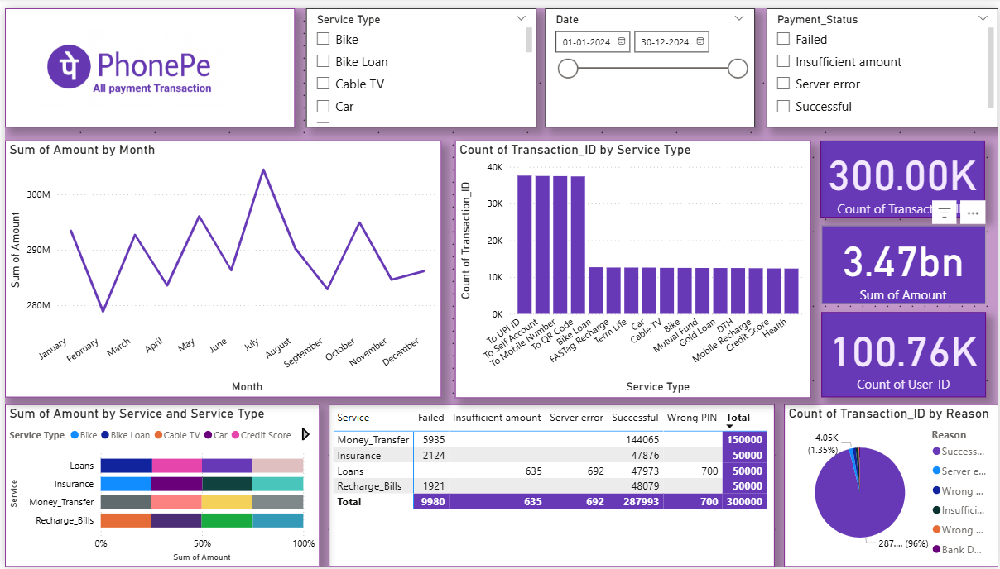
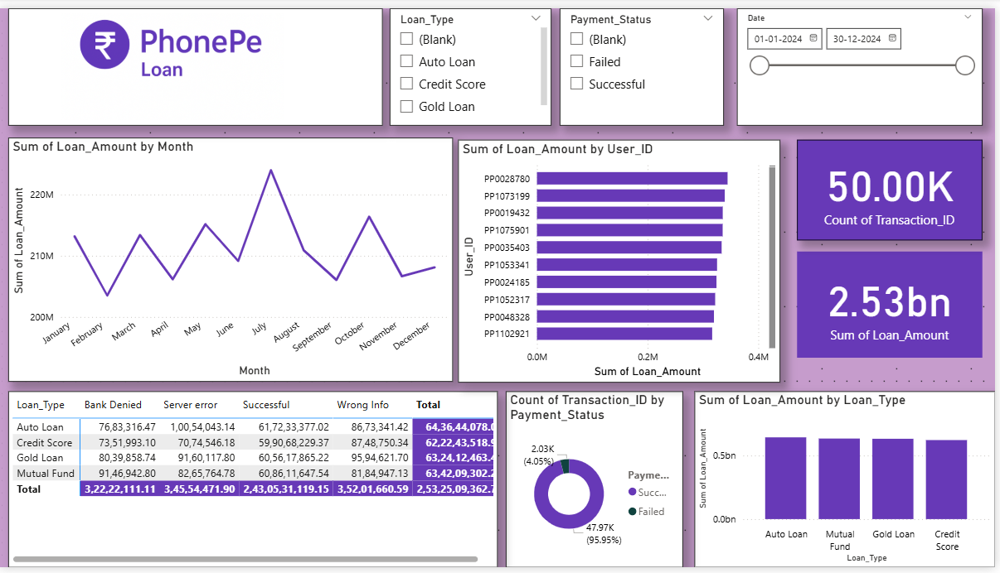
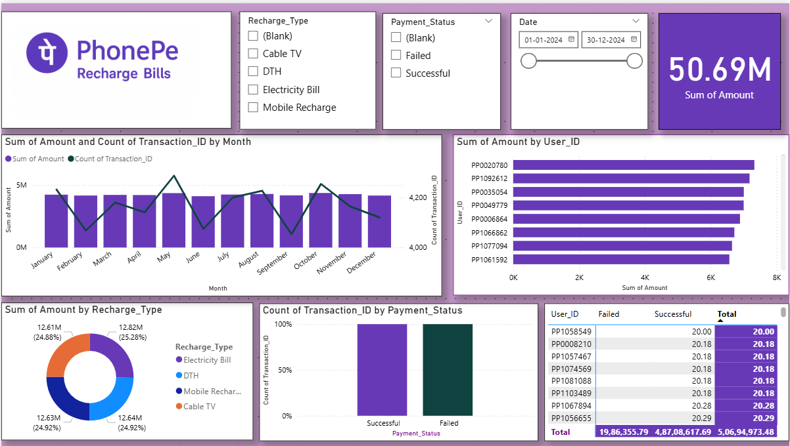
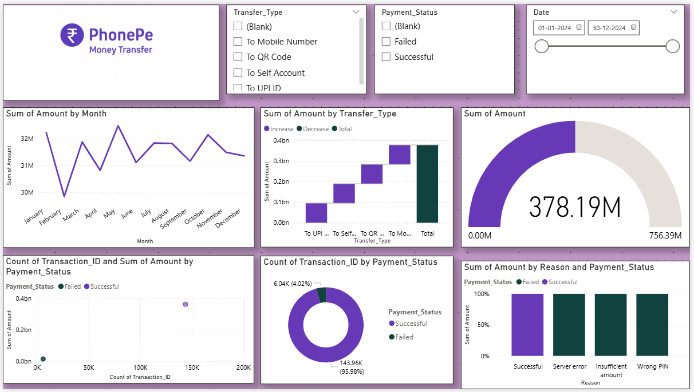
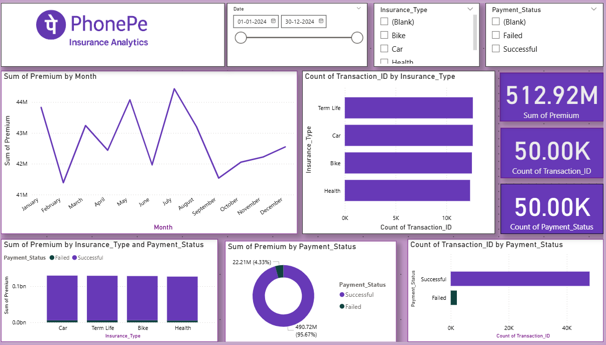

# 📊 PhonePe Transactions Analytics Dashboard | Power BI

An interactive **Power BI analytics dashboard** designed to explore **PhonePe digital transactions**, user spending behavior, and derive **business insights** such as revenue trends, category usage, and transaction performance.

This project uses a **Power BI Template (.pbit)** to allow anyone to **connect their own dataset** and generate insights instantly.

---

## 🚀 Project Overview

This dashboard provides end-to-end analysis of digital payments:

✔ Trend Analysis (Daily, Monthly, Yearly)  
✔ Category-wise Transactions  
✔ Customer Spend Behavior  
✔ High-Value Users & Frequency Trends  
✔ Transaction Status & Payment Mode Comparison  

---

## 📈 Key Insights Delivered

🔹 Which categories have highest transaction volume?  
🔹 Which time periods show peak digital payment activity?  
🔹 Who are the frequent and high-value spenders?  
🔹 Which payment modes are most preferred (UPI, Wallet, Cards, Bank Transfer)?  
🔹 What are the revenue and success rates across transaction types?  

---

## 🛠️ Tools & Technologies

| Tool        | Usage |
|-------------|-------|
| Power BI Desktop | Dashboard Design & Modeling |
| Power Query | Data Cleaning & ETL |
| DAX | Basic calculated measures |
| Excel / CSV / SQL | Data source formats |

---

## 📊 Dashboard Preview

|PhonePe – All Transactions Dashboard | PhonePe Loan Analytics Dashboard |
|--------------------|-------------------|
|  |  |

|PhonePe Recharge & Bills Analytics Dashboard | PhonePe Money Transfer Analytics Dashboard |PhonePe Insurance Analytics Dashboard |
|---------------|----------------|-------------|
|  |  |  |

---

## 📌 Business Use Cases

💼 **Fintech Analytics** – Payment tracking, transaction behavior, fraud monitoring  
🛍 **Retail & E-commerce** – Purchase trends, category patterns, user segmentation  
📱 **Digital Wallets & Payment Apps** – Usage performance, customer profiling  
📊 **Corporate Reporting** – KPI dashboards for business decisions  

---

## 💡 What Makes This Dashboard Professional?

✔ Business-focused visual storytelling  
✔ Performance-based KPI reporting  
✔ Clean, interactive, multi-page design  
✔ Scalable template for any dataset  
✔ Suitable for portfolio, job interviews, and client presentations  

---

## 📥 How to Use This Template

1️⃣ Download the `.pbit` Power BI template  
2️⃣ Open using **Power BI Desktop**  
3️⃣ Connect your dataset (Excel, CSV, SQL, etc.)  
4️⃣ Refresh to auto-populate dashboards  
5️⃣ Customize visuals and filters if needed  

---

## 🔚 Final Thoughts

This project goes beyond visualizing numbers — it delivers a **clear business narrative**, turning data into **meaningful, actionable insights**.  
It demonstrates strong capabilities in **data modeling, analytical thinking, and professional dashboard design** using Power BI.

This repository is built with a **business-focused, decision-oriented mindset** — making it suitable for  
✔ Interview showcase  
✔ Client-ready analytics solution  
✔ Professional portfolio project  
✔ Business reporting and strategic insights

If you're looking to present data in a way that supports **real business decisions**, this dashboard is a strong example of that approach.

---
